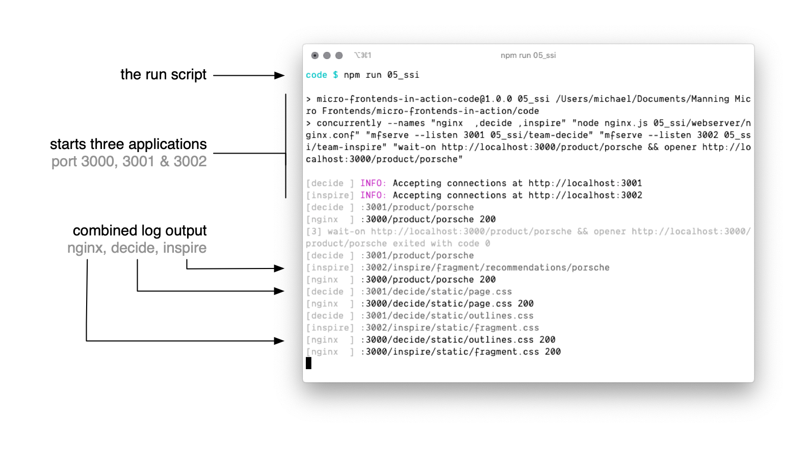
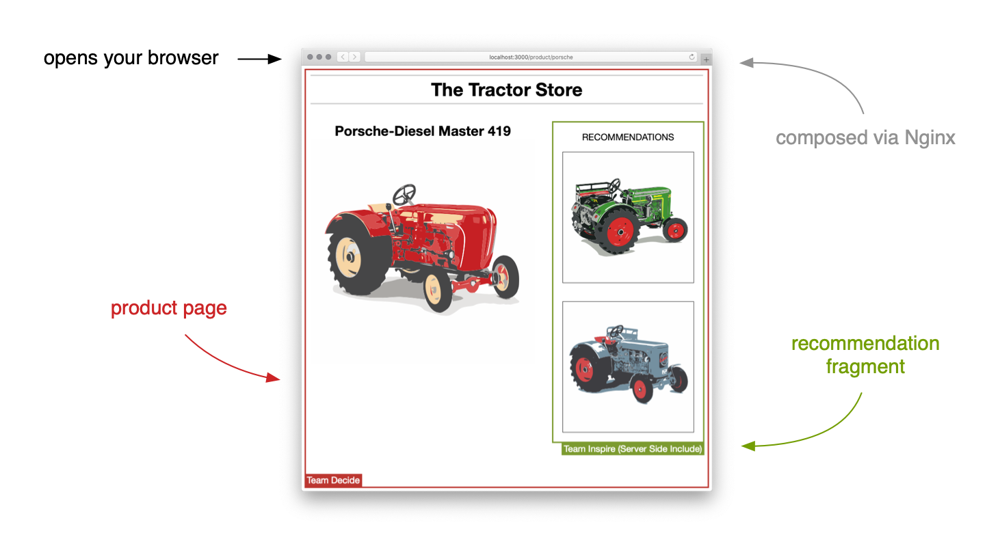

# Sample Code - Micro Frontends in Action

This is the example code that goes along with the Manning book [Micro Frontends in Action](https://itbook.store/books/9781617296871).

## Hosted examples

You can interact with the running examples here:<br> [https://the-tractor.store](https://the-tractor.store) 🚜

## Local machine

### Prerequisites

1. Clone [this git repository](https://github.com/naltatis/micro-frontends-in-action-code) or [download & extract the zip](https://github.com/naltatis/micro-frontends-in-action-code/archive/master.zip) to your local machine.

2. Make sure you have [Node.js](https://nodejs.org/) (v12 or newer) installed.

   ```
   $ node -v
   v14.4.0
   ```

3. Go into the main directory and install all required dependencies.

   ```
   cd micro-frontends-in-action-code
   npm install
   ```

4. Install Nginx on your machine. The `nginx` executable only has to be present - no configuration required.

   - _macOS (via [Homebrew](https://brew.sh)):_ `brew install nginx`
   - _Debian/Ubuntu:_ `sudo apt-get install nginx`
   - _Windows:_ Binaries included in this repository. No installation required.

   Five examples require Nginx:

   - `04_routing`
   - `05_ssi`
   - `06_timeouts_down`
   - `16_universal`
   - `18_asset_registration_include`

### Running the code

All examples involve starting up multiple applications which are owned by different teams. There is an NPM run for each directory. You can start examples like this: `npm run [name_of_example]`.

The following command will start example #5:

```
npm run 05_ssi
```

The script **starts all applications** and **shows a combined log output**.<br>
_NOTE: Nginx stdout do not work on Windows_.



It **waits until the servers are ready** and **opens the example page** in your default browser.



You can stop the example by hitting `[CMD]` + `C` in your terminal.

**NOTE:** The code should run on all platforms. However, if you're having troubles feel free to [create an issue](https://github.com/naltatis/micro-frontends-in-action-code/issues).

## Folder structure and ports

Each example has its own folder (e.g. `05_ssi`). Each example folder contains a subfolder that contains the actual application (e.g. `nginx`, `decide`, `inspire`).

Different port numbers are used to indicate ownership. This following table shows which teams owns which application. Make sure ports 3000 to 3003 are not allocated by another process on your machine.

| Port   | Team          | Responsibility                         |
| ------ | ------------- | -------------------------------------- |
| `3000` | - shared -    | infrastructure (web-server, app shell) |
| `3001` | Team Decide   | product page                           |
| `3002` | Team Inspire  | homepage, search, recommendations      |
| `3003` | Team Checkout | cart, checkout process                 |

## List of all examples

Here is a list of all run commands with a reference to the chapter they belong to.

| run script                                                                                          | name                                                                 | chapter                                                                                                 |
| --------------------------------------------------------------------------------------------------- | -------------------------------------------------------------------- | ------------------------------------------------------------------------------------------------------- |
| `npm run 01_pages_links`                                                                            | Pages & Links                                                        | [2](https://livebook.manning.com/book/micro-frontends-in-action/chapter-2/?a_aid=mfia&a_bid=5f09fdeb)   |
| `npm run 02_iframe`                                                                                 | iFrames                                                              | [2](https://livebook.manning.com/book/micro-frontends-in-action/chapter-2/?a_aid=mfia&a_bid=5f09fdeb)   |
| `npm run 03_ajax`                                                                                   | Namespaces                                                           | [3](https://livebook.manning.com/book/micro-frontends-in-action/chapter-3/?a_aid=mfia&a_bid=5f09fdeb)   |
| `npm run 04_routing`                                                                                | Server-side Routing                                                  | [3](https://livebook.manning.com/book/micro-frontends-in-action/chapter-3/?a_aid=mfia&a_bid=5f09fdeb)   |
| `npm run 05_ssi`                                                                                    | Server-side Integration                                              | [4](https://livebook.manning.com/book/micro-frontends-in-action/chapter-4/?a_aid=mfia&a_bid=5f09fdeb)   |
| `npm run 06_timeouts_down`<br>`npm run 06_timeouts_short_delay`<br>`npm run 06_timeouts_long_delay` | Timeouts & Fallbacks                                                 | [4](https://livebook.manning.com/book/micro-frontends-in-action/chapter-4/?a_aid=mfia&a_bid=5f09fdeb)   |
| `npm run 07_podium`                                                                                 | Podium                                                               | [4](https://livebook.manning.com/book/micro-frontends-in-action/chapter-4/?a_aid=mfia&a_bid=5f09fdeb)   |
| `npm run 08_web_components`                                                                         | Client-side Composition                                              | [5](https://livebook.manning.com/book/micro-frontends-in-action/chapter-5/?a_aid=mfia&a_bid=5f09fdeb)   |
| `npm run 09_shadow_dom`                                                                             | Style Isolation & ShadowDOM                                          | [5](https://livebook.manning.com/book/micro-frontends-in-action/chapter-5/?a_aid=mfia&a_bid=5f09fdeb)   |
| `npm run 10_parent_child_communication`                                                             | Parent-Child Communication                                           | [6](https://livebook.manning.com/book/micro-frontends-in-action/chapter-6/?a_aid=mfia&a_bid=5f09fdeb)   |
| `npm run 11_child_parent_communication`                                                             | Child-Parent Communication                                           | [6](https://livebook.manning.com/book/micro-frontends-in-action/chapter-6/?a_aid=mfia&a_bid=5f09fdeb)   |
| `npm run 12_fragment_fragment_communication`                                                        | Fragment-Fragment Communication                                      | [6](https://livebook.manning.com/book/micro-frontends-in-action/chapter-6/?a_aid=mfia&a_bid=5f09fdeb)   |
| `npm run 13_client_side_flat_routing`                                                               | Client-side Routing (Flat)                                           | [7](https://livebook.manning.com/book/micro-frontends-in-action/chapter-7/?a_aid=mfia&a_bid=5f09fdeb)   |
| `npm run 14_client_side_two_level_routing`                                                          | Client-side Routing (Two-Tiered)                                     | [7](https://livebook.manning.com/book/micro-frontends-in-action/chapter-7/?a_aid=mfia&a_bid=5f09fdeb)   |
| `npm run 15_single_spa`                                                                             | Single SPA                                                           | [7](https://livebook.manning.com/book/micro-frontends-in-action/chapter-7/?a_aid=mfia&a_bid=5f09fdeb)   |
| `npm run 16_universal`                                                                              | Universal Rendering                                                  | [8](https://livebook.manning.com/book/micro-frontends-in-action/chapter-8/?a_aid=mfia&a_bid=5f09fdeb)   |
| `npm run 17_asset_client_redirect`                                                                  | Asset Client-side Redirect                                           | [10](https://livebook.manning.com/book/micro-frontends-in-action/chapter-10/?a_aid=mfia&a_bid=5f09fdeb) |
| `npm run 18_asset_registration_include`                                                             | Asset Registration Include                                           | [10](https://livebook.manning.com/book/micro-frontends-in-action/chapter-10/?a_aid=mfia&a_bid=5f09fdeb) |
| `npm run 19_shared_vendor_webpack_dll`                                                              | Shared Vendor Libraries via Webpack DLLPlugin                        | [11](https://livebook.manning.com/book/micro-frontends-in-action/chapter-11/?a_aid=mfia&a_bid=5f09fdeb) |
| `npm run 20_shared_vendor_rollup_absolute_imports`                                                  | Shared Vendor Libraries via Rollup.js and Absolute ES Module Imports | [11](https://livebook.manning.com/book/micro-frontends-in-action/chapter-11/?a_aid=mfia&a_bid=5f09fdeb) |
| `npm run 21_local_development`                                                                      | Local Development                                                    | [14](https://livebook.manning.com/book/micro-frontends-in-action/chapter-14/?a_aid=mfia&a_bid=5f09fdeb) |
